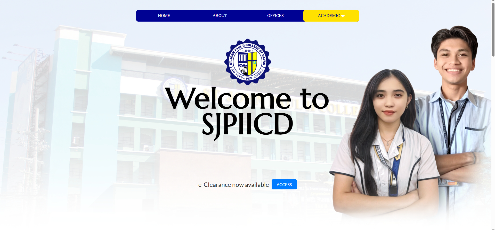
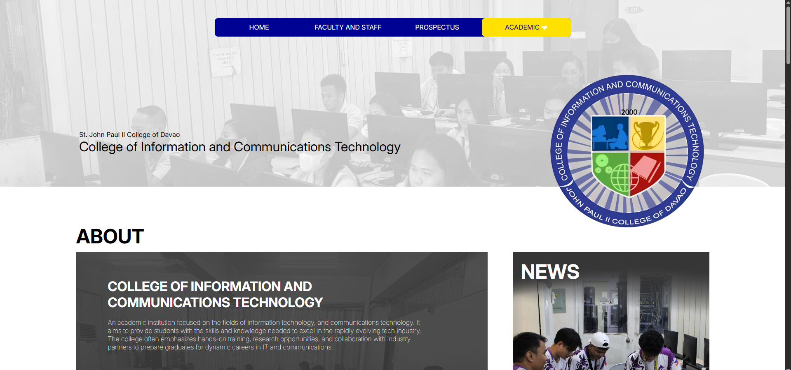
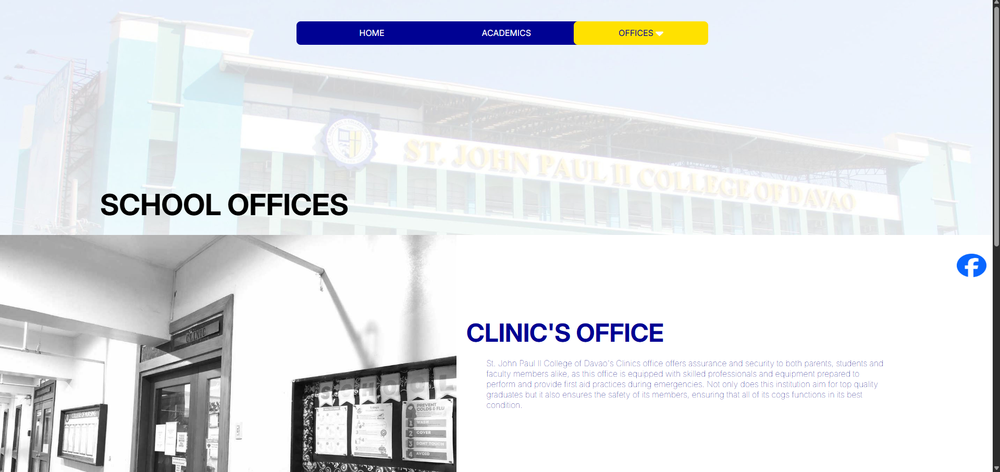

# St. John Paul II College of Davao (SJPIICD) Website System

This is a project for the **Web System and Technologies (PF117)** subject, showcasing the **St. John Paul II College of Davao** website. It includes information about courses, faculty, staff, events, and key school offices.

-------Disclaimer-------
**This is not the official website of St. John Paul II College of Davao.** This project was created as part of a course requirement for **Web System and Technologies (PF117)**. It is a student-developed project for educational purposes only.

This project was developed by **Glydel Joy Despojo**, **Judel Bagisan**, and **Rain Cereno**, with information and pictures provided by classmates.

-------Front-End Screenshots-------
  
  
  

-------Features-------
- **Courses Offered**: Details of all academic programs and courses available.
- **Faculty & Staff**: Information about the college’s faculty and administrative staff.
- **Course Events**: Events related to each course offered by the school.
- **Key School Offices**: Information about various offices within the college (e.g., Registrar, Accounting, etc.).
- **Campus News & Updates**: Latest news and announcements from the college.

-------Technologies-------
- **HTML**
- **CSS**
- **JavaScript**

-------Installation-------

1. Clone this repository:
   ```bash
   git clone https://github.com/yourusername/your-repository-name.git
   ```

2. Navigate to the project directory:
   ```bash
   cd your-repository-name
   ```

3. Open the project files in Visual Studio or IDE.

4. Run the project.

-------License-------
This project is licensed under the **MIT License**
